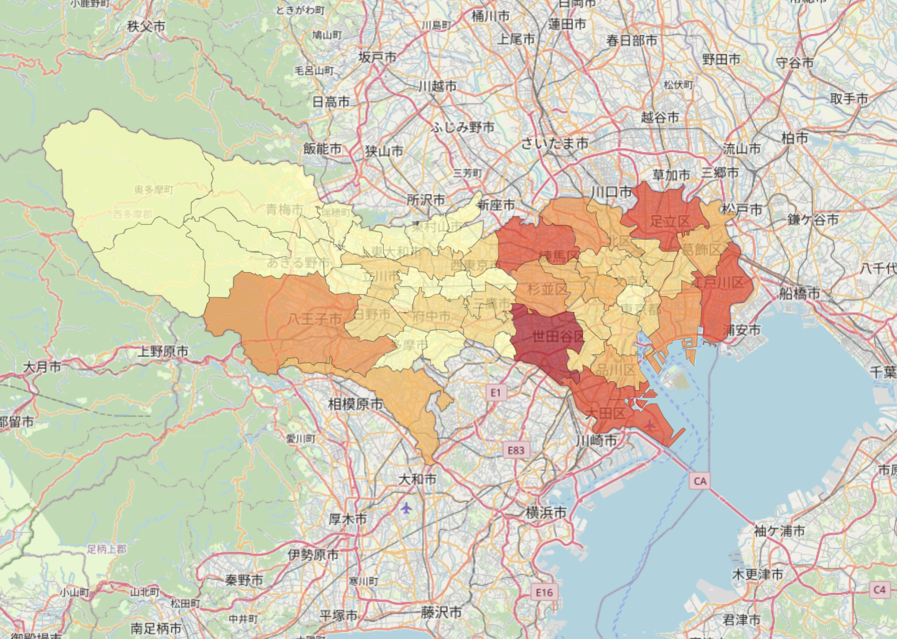

# 🗾 東京地域 人口 Choropleth Map

このプロジェクトは、東京都全域の市区町村ごとの人口分布を可視化した **Choropleth Map（コロプレスマップ）** を作成するものです。  
地理情報は `GeoJSON` ファイル、人口データは `CSV` ファイルから読み込み、`Leaflet.js` を中心としたWeb技術で描画されています。

---

## 📂 使用ファイル

| ファイル名 | 用途 |
|------------|------|
| `tokyo_population_map.html` | 地図表示用のHTMLファイル（Foliumで自動生成） |
| `tokyo.geojson` | 東京都の地理情報（市区町村の境界） |
| `tokyo.csv` | 各地域の人口データ（CSV形式） |
| `colonymap_screenshot.png` | 実行結果のスクリーンショット |
| `colonymap.py` | 地図生成のPythonスクリプト |

---

## 🔧 使用ライブラリと技術

- **Folium**：PythonでLeaflet地図を生成するライブラリ
- **Leaflet.js**：Webマップ表示のためのJavaScriptライブラリ
- **GeoJSON**：地理空間情報の表現フォーマット
- **pandas / json**：データ処理

---

## 🚀 実行方法

1. 必要なファイル（`tokyo.csv`, `tokyo.geojson`, `colonymap.py`）を同一フォルダに置く
2. 以下のコマンドでスクリプトを実行：

```bash
python colonymap.py
```

3. 実行後に `tokyo_population_map.html` が生成されます。ダブルクリックでブラウザ表示可。

---

## 📊 CSV データ形式（tokyo.csv）

```csv
地域,人口
世田谷区,939099
足立区,695121
...
```

- ヘッダーは `"地域","人口"` の順。
- 地域名は `tokyo.geojson` の `"ward_ja"` フィールドと一致している必要があります。

---

## 🖼️ 可視化サンプル

以下は実際に生成された Choropleth Map の例です：


